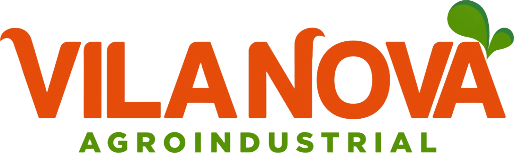

  

  <h1>Dashboard CQO Vila Nova</h1>

  

    Plataforma web de inteligencia operacional para acompanhamento de qualidade agricola,
    coletas de campo, carreamento, rampa, perdas, inventario e georreferenciamento produtivo.
  

  

    
    
    
    
  

---

## Visao Geral

O **Dashboard CQO Vila Nova** centraliza a leitura dos indicadores operacionais da qualidade agricola em uma experiencia visual moderna, responsiva e orientada a decisao.

A plataforma organiza dados de campo, rampa, coletas sincronizadas, parcelas, perdas e mapas produtivos para apoiar reunioes, auditorias internas e acompanhamento tecnico das fazendas.

O painel foi desenhado para transformar bases operacionais em leitura executiva: indicadores claros, filtros consistentes, graficos objetivos, mapas interativos e apresentacoes em tela cheia.

## Identidade Visual

A interface segue a identidade da Vila Nova Agroindustrial, combinando:

- Verde institucional para leitura agricola, estabilidade e confianca.
- Laranja como cor de acao, destaque e alerta operacional.
- Branco e tons neutros para manter contraste, clareza e boa leitura em reunioes.
- Componentes compactos, profissionais e focados em operacao real.

## Modulos Do Dashboard

### CQO Campo

Modulo voltado ao acompanhamento da qualidade agricola coletada em campo, considerando Corte e Carreamento como partes da operacao CQO.

Reune indicadores de maturacao, cachos, perdas, fiscal responsavel, origem dos dados e leitura por fazenda, semana, dia e parcela.

### Corte Campo

Visao especializada para qualidade de corte, com foco em maturacao, ocorrencias por amostragem, desempenho por origem e leitura consolidada das parcelas avaliadas.

### Carreamento

Painel dedicado ao transporte e retirada de cachos, com indicadores de nao carreamento, cacho mal posicionado, riscos por fazenda e apoio visual para apresentacao gerencial.

### CQO Rampa

Ambiente de analise da qualidade do CFF na rampa, estruturado para acompanhar fornecedores, medias mensais, fazendas, classificacoes de qualidade e evolucao operacional.

### Perdas Agricola

Modulo para leitura das perdas do processo agricola, conectando percentuais, toneladas estimadas, fazendas, semanas e origem das perdas.

### Coletas Recebidas

Central de auditoria das fichas sincronizadas pelo aplicativo de campo, com status, avaliadores, formularios, fazenda, parcela e rastreabilidade operacional.

### Inventario De Parcelas

Visao das areas produtivas por fazenda e parcela, com informacoes agronomicas relevantes para cruzamento com qualidade, perdas e produtividade.

### Mapa GPS

Mapa operacional integrado com shapes das fazendas, parcelas, semaforo de qualidade, risco por amostragem, GPS do aplicativo e leitura visual por area avaliada.

### Desenvolvimento

Area reservada para evolucao da inteligencia agricola do dende, indicadores futuros, estudos de cultura, produtividade, sanidade, estimativas e modelos de decisao.

## Inteligencia De Dados

O dashboard foi preparado para operar com multiplas origens de dados:

- Coletas digitais sincronizadas pelo aplicativo de campo.
- Snapshots historicos vindos de bases Excel.
- Dados de rampa importados para o Supabase.
- Inventario e geometrias produtivas das fazendas.
- Estruturas futuras para integracao SQL direta.

A arquitetura separa dados do aplicativo, historico operacional e bases consolidadas, permitindo transicao gradual do processo manual para o processo digital.

## Experiencia De Apresentacao

O sistema possui telas pensadas para reuniao e tomada de decisao, com apresentacoes em tela cheia, indicadores resumidos, graficos objetivos e mapas com leitura gerencial.

A proposta visual prioriza entendimento rapido: o gestor consegue identificar area critica, periodo, fazenda, parcela, responsavel e comportamento do indicador sem depender de planilhas paralelas.

## Governanca E Seguranca

O repositorio evita versionar arquivos locais de operacao, dumps, planilhas, extracoes de BI, bases sensiveis e credenciais.

As integracoes externas sao tratadas por configuracao de ambiente, mantendo chaves, snapshots privados e rotinas operacionais fora do codigo publico.

## Assinatura

Projeto desenvolvido e mantido por **Vinicius Dev.**
